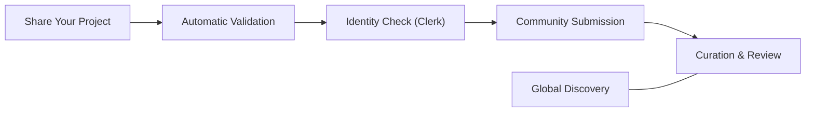
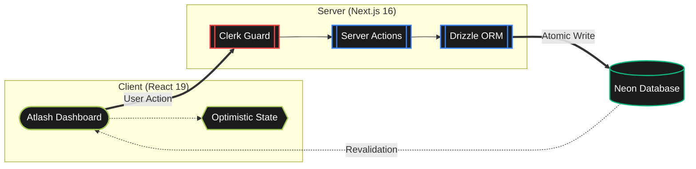

# Atlash Hub

<p align="center">
  <strong>Stop losing track of your tools. Know what exists, what works, and where to find it.</strong>
</p>

<p align="center">
  Atlash Hub gives you a clear view of everything your team has built—projects, tools, and systems—all in one place. No more digging through chats, outdated docs, or asking around for links. Just open Atlash, see what’s available, understand what’s trusted, and use what actually works.
</p>

<p align="center">
  
  
  
  
  
  
  
</p>

## The Story Behind Atlash

In the fast-paced world of software, we build amazing things every day—API layers, infrastructure blocks, and innovative tools. But often, these creations stay hidden in private repos or lost in the noise of the internet.

We built **Atlash Hub** to bridge the "Discovery Gap." It is more than just a registry; it’s a community-driven home for your hard work. Whether you are a solo builder or part of a large team, Atlash gives your projects the visibility they deserve and helps others find verified, high-quality systems to build upon.


## Table of Contents

- [Why It Matters](#why-it-matters)
- [Community Experience](#community-experience)
- [How It Works](#how-it-works)
- [The Architecture](#the-architecture)
- [Project Structure](#project-structure)
- [Technology Stack](#technology-stack)
- [Getting Started](#getting-started)
- [What’s Coming Next](#whats-coming-next)
- [License](#license)
- [Project Lead](#project-lead)


## Why It Matters

Most places that list projects feel static and hard to trust. You see links, but you don’t know what’s useful, what’s outdated, or what people actually rely on. Over time, this creates confusion instead of helping teams move faster.

**Atlash Hub** changes that by making your work clear, active, and easy to use:
- **Clarity Over Chaos:** Everything your team builds lives in one place, so you always know what exists and where to find it.
- **Built on Real Usage:** See what people are actually using and trusting, not just what’s listed.
- **Fast and Frictionless:** Every interaction feels quick and smooth, so you spend less time waiting and more time building.
- **Simple by Design:** No complex terms or clutter—just a clean, easy way to understand and use what’s available.

## Community Experience

Atlash Hub answers the questions that actually matter to builders:

- "What are people building and scaling right now?"
- "Is this tool trusted by the community?"
- "Who built this, and how can I learn from them?"
- "Where can I find a verified solution for my next project?"

## How It Works



## The Architecture

### System Flow



## Project Structure

```text
atlash-hub/
├── app/                # Next.js 16 App Router (The Home of our Pages)
│   ├── admin/          # Community Curation & Review Dashboard
│   ├── explore/        # The Global Project View
│   ├── submit/         # Submission Pipeline for Creators
│   └── globals.css     # Design Tokens & OKLCH Theme Logic
├── components/         # Our Library of Visual Blocks
│   ├── landing-page/   # Hero sections & Featured highlights
│   ├── products/       # Project Cards & Discovery UI
│   └── ui/             # Atomic design system (Tailwind 4)
├── db/                 # Database Schema & Connectivity
├── lib/                # The Logic Layer (Server Actions & Utils)
├── types/              # TypeScript Interface Definitions
└── public/             # Brand Assets & Symbols
```

## Technology Stack

- **Framework:** Next.js 16 (App Router & Streaming)
- **State:** React 19 (Server Components & Actions)
- **Database:** Neon (Serverless PostgreSQL)
- **ORM:** Drizzle ORM (Type-Safe Schema)
- **Auth:** Clerk (Secure Identity)
- **Styling:** Tailwind CSS 4 (The Future of CSS)
- **Validation:** Zod (Reliable Data Integrity)

## Getting Started

### 1. Requirements
You will need a `Neon` database connection and a `Clerk` account for authentication.

### 2. Install Dependencies

```bash
pnpm install
```

### 3. Environment Setup

Configure your `.env` with the following variables:

- `DATABASE_URL=your_neon_url`
- `NEXT_PUBLIC_CLERK_PUBLISHABLE_KEY=your_key`
- `CLERK_SECRET_KEY=your_secret`

### 4. Sync the database

```bash
pnpm drizzle-kit push
```

### 5. Start the Hub

```bash
pnpm dev
```

## What’s Coming Next

Building the initial registry was just the first step. Our goal is to turn Atlash Hub from a list of links into a **living, breathing brain** for your infrastructure.  
Here is where we are heading next:

---

### 1. Searching for what you "mean," not just what you type
> *Make search feel like a conversation, not a command.*

Most search bars are pretty basic—if you have a typo or don't know the exact name of a tool, you won't find it. We want to change that by using a **"smart search"** system that actually understands your intent.

- **How it works:**  
  Think of it like talking to a colleague. Instead of typing `Database-7`, you could type *"I need the storage tool our team uses for the mobile app"* — and the system understands the context.

- **The benefit:**  
  No more asking around just to find a URL. Discovery becomes **natural, fast, and human**.

---

### 2. A "Check Engine" light for your infrastructure
> *Know something is breaking before it actually breaks.*

Right now, we see if a tool is stable based on what people think. In the next version, the system will look at project history to **predict issues early**.

- **How it works:**  
  It tracks signals like de-listing or flags and builds a **live health score** for every project.

- **The benefit:**  
  Get early warnings before things fail — not after. Stay **ahead, not reactive**.

---

### 3. Moving at the speed of code (The CLI)
> *Manage everything without leaving your terminal.*

Clicking buttons is fine—but developers move faster in the terminal. We are building a dedicated **CLI** to make workflows seamless.

- **How it works:**  
  Run a simple command like `atlash deploy`, and everything syncs automatically in the background.

- **The benefit:**  
  No extra steps, no manual updates. Your registry stays **accurate by default**.

---

### 4. An automated "Security Guard" on autopilot
> *Security that runs quietly in the background.*

Security is critical, but often manual and ignored. We’re building a system that continuously checks project safety without human effort.

- **How it works:**  
  It acts like a **silent inspector**, regularly checking APIs and tools for compliance and safety.

- **The benefit:**  
  If something becomes unsafe, it’s instantly hidden. Your ecosystem stays **clean and protected**.

---

### 5. Instant updates where you actually hang out
> *Stay updated without refreshing anything.*

You shouldn’t have to keep checking a dashboard. We’re building a **real-time event stream** that pushes updates directly to your tools.

- **How it works:**  
  Using web-sockets, Atlash stays “awake” and sends updates the moment something changes.

- **The benefit:**  
  Your team stays in sync automatically. No delays, no missed updates—just **real-time awareness**.

## License

This project is open-sourced under the **MIT License**. See the [LICENSE](LICENSE) file for details.

## Project Lead 

Crafted with passion by **[Abdul Rahman](https://github.com/abdul-rahman-0x)**  
